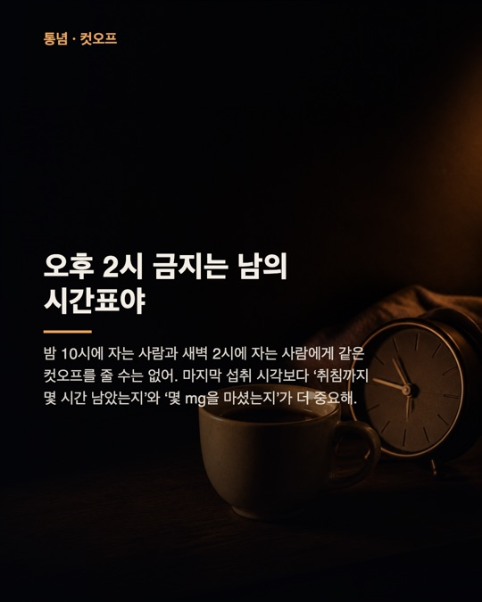
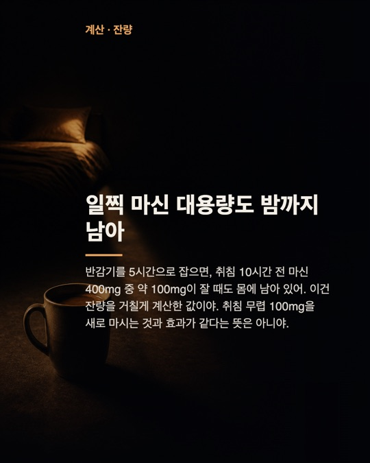
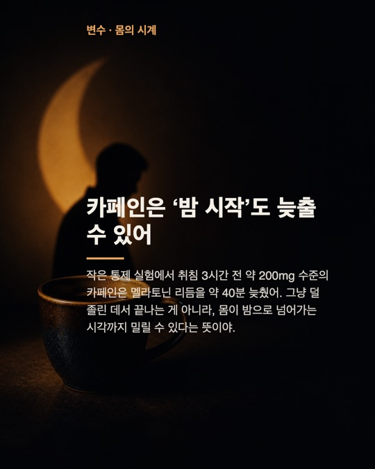
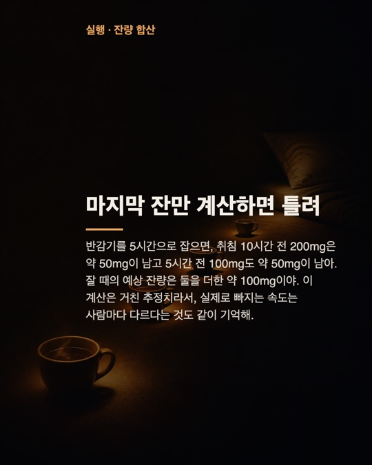

# Instagram Carousel Studio

<p align="center">
  <a href="#english">English</a> · <a href="#korean">한국어</a>
</p>

Create a complete Instagram carousel package from one topic: 5–8 source-checked cards, AI-generated backgrounds, publish-ready 1080×1350 PNGs, caption, hashtags, alt text, and source files.

주제 하나로 출처가 검증된 5–8장 Instagram 캐러셀, AI 배경 이미지, 1080×1350 게시용 PNG, 캡션, 해시태그, 대체 텍스트, 출처 파일까지 한 번에 만듭니다.

## Example output · 생성 예시

The seven cards below were generated by this project for the topic **“How caffeine timing affects sleep.”** Click any card to view it at the README preview size. Production output is saved at 1080×1350.

아래 7장은 이 프로젝트가 **“카페인이 잠을 방해하는 시간의 진짜 기준”**이라는 주제로 직접 생성한 결과입니다. 카드를 누르면 README용 미리보기 크기로 볼 수 있으며, 실제 게시 파일은 1080×1350으로 저장됩니다.

> This sample demonstrates the output format and is not personal medical advice. · 이 예시는 출력 형식을 보여주기 위한 것으로 개인 의료 조언이 아닙니다.

<p align="center">
  <a href="docs/images/caffeine-carousel-01.jpg"></a>
  <a href="docs/images/caffeine-carousel-02.jpg"></a>
  <a href="docs/images/caffeine-carousel-03.jpg"></a>
</p>
<p align="center">
  <a href="docs/images/caffeine-carousel-04.jpg"></a>
  <a href="docs/images/caffeine-carousel-05.jpg"></a>
  <a href="docs/images/caffeine-carousel-06.jpg"></a>
</p>
<p align="center">
  <a href="docs/images/caffeine-carousel-07.jpg"></a>
</p>

---

<a id="english"></a>

## English

### What it does

1. Generates a 5–8 card carousel and Instagram post copy.
2. Reviews every card for novelty, factual quality, and natural writing.
3. Uses live web search through the selected text provider to attach sources and block unsupported claims.
4. Rewrites only weak cards instead of regenerating the entire carousel.
5. Applies one selectable writing tone consistently to cards, captions, revisions, and review.
6. Offers 128 topic ideas across 16 optional categories while keeping free-form topic input available.
7. Lets you review the verified writing before starting the image stage.
8. Lets you edit every card, caption, and hashtag; saved edits become the input to final image composition.
9. Generates one visual per card with GPT Image.
10. Composites and saves final 4:5 PNGs plus the complete post package.

The Studio runs locally. By default, writing and fact-checking reuse your Codex CLI “Sign in with ChatGPT” session; the app never reads or copies the OAuth token. Generated posts stay in the ignored `output/` directory.

### Requirements

- Node.js 20 or newer
- Codex CLI signed in with ChatGPT for the default OAuth text workflow
- An OpenAI API key with GPT Image access only when generating backgrounds
- API organization verification may be required for GPT Image models

The default models are `gpt-5.6-terra` through Codex OAuth for text and `gpt-image-2` through the OpenAI Images API. You can also switch the text provider to direct OpenAI API access in Studio.

The Studio includes eight writing-tone presets: `casual` (friendly informal), `polite` (friendly polite), `expert` (calm expert), `punchy` (short and direct), `storyteller` (immersive storytelling), `witty` (light wit), `teacher` (beginner-friendly explanation), and `analytical` (clear reasoning). The default is `casual`, and the tone can be selected directly in the production form.

### Setup

```bash
git clone https://github.com/sueun-dev/instagram-carousel-studio.git
cd instagram-carousel-studio
npm install
cp .env.example .env
```

Sign in to Codex once. The Studio reuses this saved ChatGPT session for writing and fact-checking:

```bash
codex login
codex login status
```

Add an API key to `.env` only if you want the image stage (or choose the direct OpenAI API text provider):

```dotenv
OPENAI_API_KEY=your_key_here
```

Start the Studio:

```bash
npm start
```

Open `http://127.0.0.1:5273/`.

### CLI

```bash
# Generate and verify carousel content
npm run generate -- --topic "How caffeine timing changes sleep"

# The default provider is Codex with your saved ChatGPT OAuth session
npm run generate -- --provider codex --topic "How caffeine timing changes sleep"

# Choose a writing tone
npm run generate -- --topic "How caffeine timing changes sleep" --tone polite

# Generate content without the review loop
npm run generate -- --topic "How caffeine timing changes sleep" --generate-only

# Resume review from an existing result
npm run generate -- \
  --in output/<result>/carousel.json \
  --max-revisions 3 \
  --out output/resumed-carousel.json

# Generate source background images for an existing result
npm run images -- \
  --in output/<result>/carousel.json \
  --out output/<result>
```

Generation exits with code `0` when the package passes verification and code `2` when it does not.

### Output

Each run gets a unique `output/<topic>-<timestamp>/` directory:

- `carousel.json` — generated content, review result, fact-check result, and sources
- `card-N.png` — AI-generated source backgrounds
- `instagram-01.png` through `instagram-08.png` — final 1080×1350 cards
- `caption.txt` — caption and hashtags ready to copy
- `instagram-post.json` — image list, alt text, dimensions, and post metadata
- `sources.txt` — source URLs used during fact-checking

### Project structure

```text
src/
  config/              editable model and topic settings
  lib/                 API, validation, packaging, and runtime helpers
  prompts/             generation, review, and fact-check instructions
  studio/              browser UI, styles, and canvas compositor
  generate-carousel.mjs
  generate-images.mjs
  studio-server.mjs
tests/                  deterministic unit and HTTP integration tests
examples/               verified sample carousel JSON
docs/images/            lightweight README example images
output/                 local generated files; ignored by Git
```

### Checks

```bash
npm run check
```

The test suite does not call external APIs. It covers the 5–8 card contract, targeted revisions, manual edit persistence, fact-check failure handling, source extraction, image retries, path traversal protection, unique output directories, and the full Studio HTTP workflow.

### Security

- `.env` and generated outputs are ignored by Git.
- OAuth credentials stay under Codex credential management; this app never opens or copies `~/.codex/auth.json`.
- Never put API keys in source files, prompts, examples, screenshots, or issues.
- The server binds to `127.0.0.1` by default. It is a local tool, not a hardened multi-user service.

---

<a id="korean"></a>

## 한국어

### 주요 기능

1. 주제에 맞는 5–8장 캐러셀과 Instagram 게시글을 생성합니다.
2. 각 카드의 새로움, 사실성, 자연스러운 문체를 검토합니다.
3. 선택한 글 제공자의 실시간 웹 검색으로 카드별 출처를 연결하고 근거가 부족한 주장을 차단합니다.
4. 전체를 다시 만들지 않고 기준을 통과하지 못한 카드만 재작성합니다.
5. 선택한 글 말투를 카드·캡션·재작성·검증 단계 전체에 일관되게 적용합니다.
6. 16개 분야의 키워드 예시 128개를 제공하며, 아무것도 선택하지 않고 주제를 직접 입력할 수도 있습니다.
7. 검증된 글을 먼저 확인하고 확정한 뒤 이미지 제작을 시작합니다.
8. 각 카드의 소제목·제목·본문과 캡션·해시태그를 직접 수정하고, 저장한 수정본을 최종 이미지에 반영합니다.
9. GPT Image로 카드마다 하나의 배경 이미지를 생성합니다.
10. 텍스트를 합성한 최종 4:5 PNG와 게시 패키지를 함께 저장합니다.

Studio는 로컬에서 실행됩니다. 기본값은 Codex CLI의 “ChatGPT로 로그인” 세션을 글 작성과 팩트체크에 재사용하며, 앱이 OAuth 토큰을 직접 읽거나 복사하지 않습니다. 생성 결과는 Git에서 제외된 `output/` 폴더에 저장됩니다.

### 실행 조건

- Node.js 20 이상
- 기본 OAuth 글 생성용 Codex CLI와 ChatGPT 로그인
- 배경 이미지 생성 시에만 GPT Image를 사용할 수 있는 OpenAI API 키
- GPT Image 모델 사용 시 API 조직 인증이 필요할 수 있습니다.

기본 모델은 글 `gpt-5.6-terra`(Codex OAuth), 이미지 `gpt-image-2`(OpenAI Images API)입니다. Studio 설정에서 글 연결 방식을 OpenAI API 키로 바꿀 수도 있습니다.

Studio의 메인 제작 화면에서 `친근한 반말(casual)`, `친근한 존댓말(polite)`, `차분한 전문가(expert)`, `짧고 강한 직설(punchy)`, `몰입형 스토리텔링(storyteller)`, `가벼운 위트(witty)`, `친절한 설명형(teacher)`, `논리적인 분석형(analytical)` 중 글 말투를 고를 수 있습니다. 기본값은 `casual`입니다.

### 설치 및 실행

```bash
git clone https://github.com/sueun-dev/instagram-carousel-studio.git
cd instagram-carousel-studio
npm install
cp .env.example .env
```

Codex에 한 번 로그인합니다. 이후 Studio가 저장된 ChatGPT 세션을 글 작성과 팩트체크에 재사용합니다.

```bash
codex login
codex login status
```

이미지 제작까지 할 때만(또는 글 연결 방식을 OpenAI API로 선택할 때) `.env`에 API 키를 입력합니다.

```dotenv
OPENAI_API_KEY=your_key_here
```

Studio를 실행합니다.

```bash
npm start
```

브라우저에서 `http://127.0.0.1:5273/`을 엽니다.

### CLI 사용법

```bash
# 콘텐츠 생성 및 검증
npm run generate -- --topic "카페인이 수면에 미치는 영향"

# 기본값: 저장된 ChatGPT OAuth 세션을 사용하는 Codex 제공자
npm run generate -- --provider codex --topic "카페인이 수면에 미치는 영향"

# 글 말투 선택
npm run generate -- --topic "카페인이 수면에 미치는 영향" --tone polite

# 검증 과정 없이 콘텐츠만 생성
npm run generate -- --topic "카페인이 수면에 미치는 영향" --generate-only

# 기존 결과를 불러와 검증·재작성을 이어서 실행
npm run generate -- \
  --in output/<result>/carousel.json \
  --max-revisions 3 \
  --out output/resumed-carousel.json

# 기존 carousel.json으로 카드 배경 이미지 생성
npm run images -- \
  --in output/<result>/carousel.json \
  --out output/<result>
```

검증을 통과하면 종료 코드 `0`, 통과하지 못하면 종료 코드 `2`를 반환합니다.

### 생성 결과

실행할 때마다 `output/<topic>-<timestamp>/` 형식의 고유 폴더가 만들어집니다.

- `carousel.json` — 생성 콘텐츠, 편집 검토, 팩트체크 결과, 출처
- `card-N.png` — AI가 만든 원본 배경 이미지
- `instagram-01.png`부터 `instagram-08.png` — 최종 1080×1350 게시 이미지
- `caption.txt` — 바로 복사할 수 있는 캡션과 해시태그
- `instagram-post.json` — 이미지 목록, 대체 텍스트, 규격, 게시 메타데이터
- `sources.txt` — 팩트체크에 사용한 출처 URL

### 폴더 구조

```text
src/
  config/              모델과 주제 설정
  lib/                 API, 검증, 패키징, 공통 실행 도구
  prompts/             콘텐츠 생성·검토·팩트체크 지침
  studio/              브라우저 UI, 스타일, Canvas 합성 코드
  generate-carousel.mjs
  generate-images.mjs
  studio-server.mjs
tests/                  단위 테스트와 HTTP 통합 테스트
examples/               검증을 통과한 캐러셀 JSON 예시
docs/images/            README용 경량 예시 이미지
output/                 로컬 생성 결과; Git에서 제외
```

### 테스트

```bash
npm run check
```

테스트는 외부 API를 호출하지 않습니다. 5–8장 계약, 선택적 카드 재작성, 수동 수정 저장, 팩트체크 실패 처리, 출처 추출, 이미지 재시도, 경로 이탈 차단, 고유 출력 폴더, Studio HTTP 전체 흐름을 검증합니다.

### 보안

- `.env`와 생성 결과물은 Git에 포함되지 않습니다.
- OAuth 인증 정보는 Codex가 관리하며, 이 앱은 `~/.codex/auth.json`을 열거나 복사하지 않습니다.
- API 키를 소스 코드, 프롬프트, 예시, 스크린샷, 이슈에 넣지 마세요.
- 서버는 기본적으로 `127.0.0.1`에만 연결됩니다. 다중 사용자용 공개 서버로 설계된 도구는 아닙니다.

## License · 라이선스

MIT
